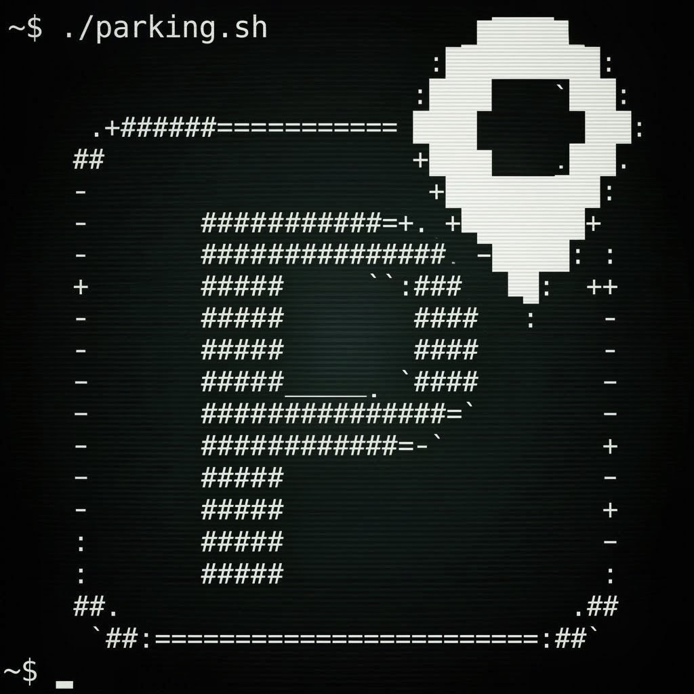

  
  <h1>Cussi Parking Server</h1>

A lightweight, privacy-first backend for the Cussi Parking Android application. Built with PHP and SQLite, this server is designed to be fully self-hosted, giving you absolute control over your location data without relying on third-party cloud services.

It is highly optimized to run on low-resource hardware, including the Raspberry Pi Zero W.

## Companion App

This server acts exclusively as the backend infrastructure for the **Cussi Parking Android App**. You will need the mobile application to interact with this server, manage your vehicles, and utilize the automatic location triggers (Bluetooth/NFC).

## Features

* **Absolute Privacy:** You own the database. Location data, user credentials, and triggers are stored locally on your machine.
* **Lightweight Architecture:** Uses SQLite as the database engine, eliminating the need for heavy SQL server processes (like MySQL or MariaDB).
* **Role-Based Access Control:** Users are categorized as "owners" or "members". Owners can manage vehicles and generate time-limited invite codes.
* **Secure Sharing:** Temporary, single-use invite codes allow family members to sync and track the same vehicles.
* **Token Authentication:** Uses secure, hashed token-based authentication for API communication with the Android client.
* **Automated Deployment:** Includes an installation script tailored for ARMv6 devices (Raspberry Pi) that automatically configures Caddy, PHP-FPM, and Let's Encrypt SSL certificates via DuckDNS.

## Prerequisites

To use the automated installation script, you will need:
1. A Debian/Ubuntu-based Linux environment (specifically tested on Raspberry Pi OS 32-bit).
2. A registered subdomain and token from DuckDNS (https://www.duckdns.org/).
3. Ports 80 and 443 forwarded from your router to your server's local IP address.

## Installation (Automated)

The repository includes a Bash script (install-32bit.sh) designed to automate the entire setup process on ARMv6 hardware.

1. Clone the repository to your server:
   git clone https://github.com/marcomorosi06/Cussi-Parking-Server.git
   cd Cussi-Parking-Server

2. Make the script executable:
   chmod +x install-32bit.sh

3. Run the installer with root privileges:
   sudo ./install-32bit.sh

4. Follow the on-screen prompts. You will be asked to provide your DuckDNS domain, DuckDNS token, and an email address (used by Caddy for Let's Encrypt SSL provisioning).

### What the script does:
* Updates the system packages.
* Installs php-fpm, php-sqlite3, curl, and cron.
* Downloads the ARMv6 binary of the Caddy web server.
* Configures Caddy as a reverse proxy with PHP-FPM integration.
* Sets up an automated Cron job to keep your DuckDNS IP address updated.
* Copies the PHP scripts to /var/www/parcheggio and applies the correct read/write permissions for the www-data user (required for SQLite).

## Manual Installation

If you are deploying on an x86/x64 server, a standard VPS, or prefer manual setup:
1. Install a web server (Nginx, Apache, or Caddy) and PHP with the SQLite extension (php-sqlite3).
2. Point your web server's document root to the folder containing these PHP files.
3. Ensure the web server user (e.g., www-data) has read and write permissions to both the directory and the parcheggio.sqlite database file (which will be generated automatically on the first request).
4. Secure your endpoint with an SSL certificate.

## API Structure

The server exposes several stateless PHP endpoints designed to be consumed by the Android application:

* login.php - Authenticates a user and issues an access token.
* add_vehicle.php / delete_vehicle.php - Manages vehicle records.
* update_location.php - Updates the GPS coordinates of a vehicle.
* invite_code.php - Generates 24-hour invite codes and handles the joining logic.
* add_member.php / remove_member.php / change_role.php - Granular permission management.

All API responses are formatted as JSON.

## Security & Liability Disclaimer

While this project includes automation scripts designed to simplify the deployment of secure connections (such as Caddy with auto-renewing Let's Encrypt SSL certificates), **the ultimate responsibility for securing the server environment falls on the end-user.** Self-hosting requires exposing ports to the public internet. Please ensure your router, firewall, and host operating system are properly configured and kept up to date. The source code is entirely public for transparency and auditing. However, as this is an open-source project provided "as is", the author accepts no liability for any potential security vulnerabilities, data breaches, or unauthorized access to your hosted instance. You are highly encouraged to review the code and implement additional network security measures as you see fit.

## License

This project is licensed under the MIT License.

MIT License

More informations in the LICENSE.md file inside of the repository.
